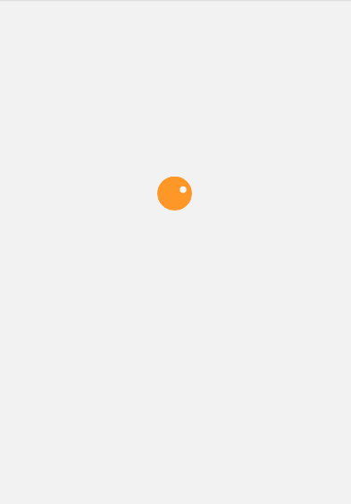

# 动画库

React Native 由于并不支持 CSS3 动画，所以我们实现动画效果需要使用其内置的 `Animated` 库

## 类型值
提供两种类型值，其可以绑定到样式获其它属性上

- [`Animated.Value()`](https://reactnative.cn/docs/animated#value) 用于单个值
- [`Animated.ValueXY()`](https://reactnative.cn/docs/animated#valuexy) 用于矢量值

## 配置动画
`Animated` 提供了三种动画类型。每种动画类型都提供了特定的函数曲线，用于控制动画值从初始值变化到最终值的变化过程：

- [`Animated.decay()`](https://reactnative.cn/docs/animated#decay) 指定的初始速度开始变化，然后变化速度越来越慢直至停下。
- `[Animated.spring()](https://reactnative.cn/docs/animated#spring)` 提供了一个基础的弹簧物理模型.
- [`Animated.timing()`](https://reactnative.cn/docs/animated#timing) 使用 [easing 函数](https://reactnative.cn/docs/easing) 让数值随时间动起来。

大多数情况下你应该使用 `timing()`。默认情况下，它使用对称的 easeInOut 曲线，将对象逐渐加速到全速，然后通过逐渐减速停止结束。

## 使用动画
通过调用 `start()` 函数启动动画。

- `start` 函数可以传入回调函数，动画完成时通知调用
- 正常运行完成，回调值 `{ finished: true }`
- 调用 `stop` 函数结束，回调值 `{ finished: false }`

## 自定义动画组件
可以通过 `createAnimatedComponent` 来封装任意 React 组件，使其动画化

- `Animated.Image`
- `Animated.ScrollView`
- `Animated.Text`
- `Animated.View`

### Loading 动画
实现效果


直接上代码

```javascript
import React, {useRef, useEffect} from 'react';
import {View, StyleSheet, Animated, Easing} from 'react-native';

const Loading = () => {
  let spinAnim = useRef(new Animated.Value(0));

  const loadingAnim = () => {
    Animated.timing(spinAnim.current, {
      toValue: 1,
      duration: 1500,
      easing: Easing.linear,
      useNativeDriver: true,
    }).start(({finished}) => {
      if (finished) {
        spinAnim.current.setValue(0);
        loadingAnim();
      }
    });
  };

  useEffect(() => {
    loadingAnim();
  });

  //映射 0-1 的值 映射 成 0 - 360 度
  const spin = spinAnim.current.interpolate({
    inputRange: [0, 1], //输入值
    outputRange: ['0deg', '360deg'], //输出值
  });

  return (
    <View style={Styles.loading}>
      <View style={Styles.loader}>
        <Animated.View
          style={[
            Styles.loaderBall,
            {
              transform: [{rotate: spin}],
            },
          ]}>
          <View style={Styles.loaderBallHook} />
        </Animated.View>
      </View>
    </View>
  );
};

const Styles = StyleSheet.create({
  loading: {
    width: '100%',
    height: '70%',
    display: 'flex',
    justifyContent: 'center',
    alignItems: 'center',
  },
  loader: {
    display: 'flex',
    justifyContent: 'center',
    alignItems: 'center',
    height: 35,
    width: 35,
    borderRadius: 35,
    backgroundColor: '#FE9727',
  },
  loaderBall: {
    position: 'relative',
    height: 30,
    width: 30,
    borderRadius: 30,
  },
  loaderBallHook: {
    position: 'absolute',
    zIndex: 1,
    left: 5,
    top: 5,
    height: 7,
    width: 7,
    backgroundColor: '#fff',
    borderRadius: 7,
  },
});

export default Loading;
```
