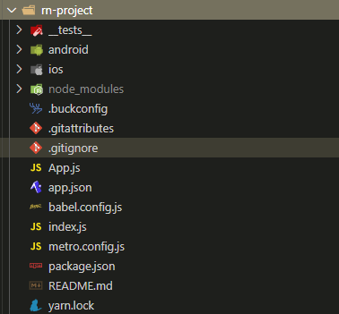

# 初识项目

在上一篇我们万里长征走了第一步，也是最重要的一步，环境和项目都初始成功了，接下来我们来好好认识下项目结构。



上图我们可以看到项目初始化后的一个结构

```markdown
├── __tests__    # 测试
├── android      # 编译后的 android 
├── ios          # 编译后的 ios 
├── App.js       # 源码页面组件 
├── app.json     # 应用的一些配置
├── indx.js      # 项目入口
└── ...

```

## App.js
```javascript
import { StatusBar } from 'expo-status-bar';
import React from 'react';
import { StyleSheet, Text, View } from 'react-native';

export default function App() {
  return (
    <View style={styles.container}>
      <Text>Open up App.js to start working on your app!</Text>
      <StatusBar style="auto" />
    </View>
  );
}

const styles = StyleSheet.create({
  container: {
    flex: 1,
    backgroundColor: '#fff',
    alignItems: 'center',
    justifyContent: 'center',
  },
});

```

我们看到 App.js 中代码只有寥寥几行，最重要的是和 React 一样使用 JSX 语法，如果还没了解过 JSX 语法的，可以自行了解下，这里不做过多解释。

```javascript
import { StyleSheet, Text, View } from 'react-native';
```
我们看到 React Native 使用的元素和我们以前接触的 web 开发是不同的，这是 React Native 自行封装的组件，只有这样在编译时，才会编译出移动应用识别的代码，如果熟悉微信小程序开发，会更加的理解这种编写方式。
