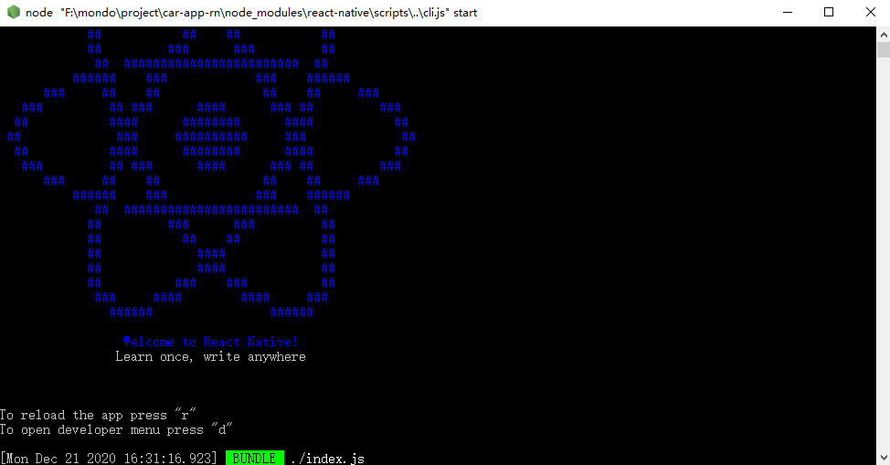

# 安装环境

> React Native 安装环境的谜之复杂可能让你还没开始就要放弃

环境安装一定要按照[官方文档](https://reactnative.cn/docs/getting-started.html)的流程一步步来，**切记！切记！切记！**

## Windows 平台
如果使用 window 作为开发环境，我们只能开发 Android 应用。<br />必要的依赖：

- `Node` 需要 v12 版本以上
- `JDK` 必须是 1.8 版本或者 8 版本
- `Android Studio`

### Java 安装

jdk 安装需要安装 1.8 版本，环境安装可以参考[这篇博客](https://blog.csdn.net/weixin_44084189/article/details/98966787/)

### Android 环境

- 下载 [Android Studio](https://developer.android.com/studio/index.html)，安装界面 Custom 确认选中下列项：
   - Android SDK
   - Android SDK Platform
   - Performance (Intel ® HAXM) ([AMD 处理器看这里](https://android-developers.googleblog.com/2018/07/android-emulator-amd-processor-hyper-v.html))
   - Android Virtual Device
- Android SDK：可在欢迎界面找到 SDK Manager，安装 android 9 (pie)

## macOS 平台
如果使用 mac 开发，我们可以开发 IOS 和 Android 两种应用。

### IOS 环境
必要的依赖：

- `Node` 需要 v12 版本以上
- `watchman` 是由 Facebook 提供的监视文件系统变更的工具。安装此工具可以提高开发时的性能（packager 可以快速捕捉文件的变化从而实现实时刷新）
- `Xcode` 可以在 App Store 找到直接下载
- `CocoaPods`


使用前的环境安装一定要按照官方文档来，不然后面出现各种异常让人直接想放弃使用，安装环境主要注意 Android Studio 的安装。

## Hello World

当我们安装完上面一系列的环境后，如果一起顺利的话，我们就可以准备初始项目，跑起来一个 Hello World

我们运行项目前需要打开 android 模拟器

### 运行项目
```shell
npx create-react-native-app rn-project

cd rn-project

yarn android
```

第一运行项目，编译时间可能会比较长，如果一切顺利会弹出一个 cmd 框，这个运行项目的时候是不能关闭的，它是一个 node 监听服务。



模拟器上出现界面


恭喜你万里长征已经走了一半了！


## 异常处理

### 异常 JAVA_HOME

启动命令编译时抛出异常


需要我们找到 Android Studio 安装目录下 jre 目录

设置系统变量 JAVA_HOME


对应的 PATH 路径需要添加两条记录
```javascript
%JAVA_HOME%\bin
%JAVA_HOME%\jre\bin
```


**重新打开 cmd 运行成功**

### 异常 app:installDebug

抛出异常


在 **android** 目录下查看 `local.properties` 文件，没有自己新建一个，指定 `android sdk` 安装目录

```
sdk.dir=E\:\\androidsdk
```

### 异常  Text strings must be rendered within a <Text> component


- 要删除代码行中的注释
- Text 组件需要判断值，不能为空字符串

```javascript
{province ? <Text className="province">{province}</Text> : null}
```
