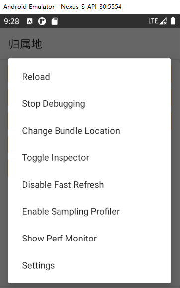

# 如何调试

> 这里使用的开发平台是 Window 环境

## 第三方模拟器

React Native 调试可以使用 `Android Studio` 自带的模拟器

也可以使用第三方模拟器；这里选用雷电模拟器

- 打开模拟器调试模式：应用设置 -> 关于平板电脑 -> 连续点击 5 次版本号 -> USB 调试
- 连接模拟器
   - `win + r` 然后打开 `cmd`
   - `adb connect 127.0.0.1:5555`
   - 不同模拟器的端口号是不同的
- 在项目根目录下运行 `yarn android`

如果出现 adb 不是命令，需要添加环境变量，找到 `Android Studio JDK` 安装目录下 `platform-tools` 目录

### 调试
点击更多 -> 摇一摇 -> debug

### Chrome 调试
所有的调式都可以打开地址 [http://localhost:8081/debugger-ui/](http://localhost:8081/debugger-ui/) 来进行查看

## 真机调试
> 这里指 Android 手机

- 需要打开手机 USB 调试模式，直连数据线至电脑
- 项目根目录执行命令: `yarn android`

项目成功启动后会在手机上看到启动的程序，如果需要调试，需要**摇一摇**手机可以看到弹框

选择 **Debug** 利用 Chrome 调试

## react-native-debugger
这个 debugger 插件很强大。

使用：

-  关闭 Chrome 浏览器中所有的 [http://localhost:8081/debugger-ui/](http://localhost:8081/debugger-ui/) 页面（RN默认的 debugger 工具）

- 下载 [react-native-debugger](https://github.com/jhen0409/react-native-debugger/releases) 应用
- ` Android Studio` 模拟器中的** **`Nexus S` ，因为这个模型是有菜单键的，高版本的模拟器通常没有。
-  使用快捷键 `Ctrl+M` 也可以打开菜单栏。

## 跨域处理

查了大半资料，建议还是使用 **nginx 做反向代理处理**
