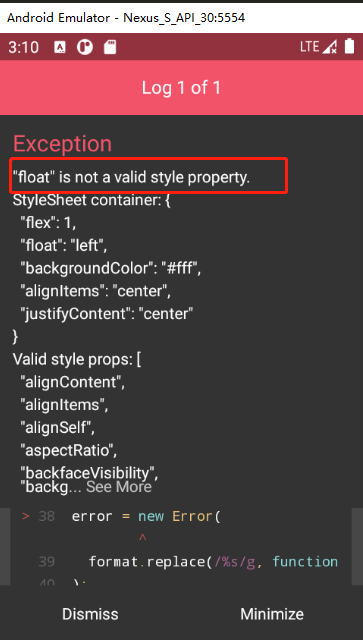
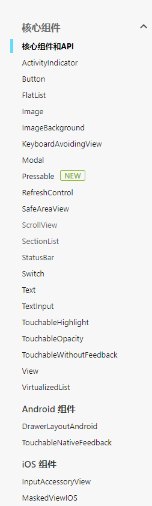
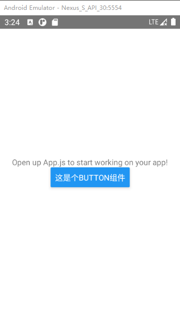
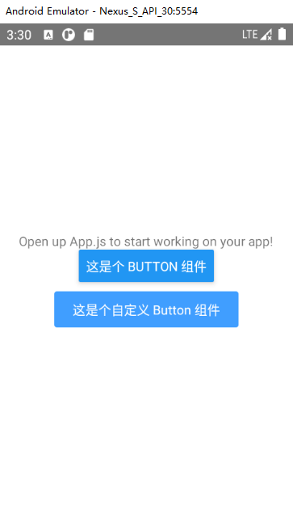

# 布局与组件

## 样式

样式基本遵循 `WEB CSS` 的写法，只是属性需要按照**驼峰命名法**; 例如: `background-color`改为`backgroundColor`。

```javascript
import { StatusBar } from 'expo-status-bar';
import React from 'react';
import { StyleSheet, Text, View } from 'react-native';

export default function App() {
  return (
    <View style={styles.container}>
      <Text>Open up App.js to start working on your app!</Text>
      <StatusBar style="auto" />
    </View>
  );
}

const styles = StyleSheet.create({
  container: {
    flex: 1,
    backgroundColor: '#fff',
    alignItems: 'center',
    justifyContent: 'center',
  },
});
```

### 写法

- 应用样式可以写在组件元素上

```javascript
<Image
  source={{
    uri: 'https://reactnative.dev/docs/assets/p_cat2.png',
  }}
  style={{
      width: 100,
      height: 100,
  }}
/>
```

- 也可以使用 `StyleSheet.create` 集中定义组件样式(推荐)

```javascript
import {
	...,
  StyleSheet,
} from 'react-native';
<Image
	source={{
    uri: 'https://reactnative.dev/docs/assets/p_cat2.png',
  }}
  style={styles.logo}
/>
    
const styles = StyleSheet.create({
  logo: {
    width: 100,
    height: 100,
  }
});
```

- 多个样式可以以数组形式添加在一起

```javascript
<Image
	source={{
    uri: 'https://reactnative.dev/docs/assets/p_cat2.png',
  }}
  style={[styles.logo, style.test]}
/>
```

### 注意

- `width`，`height`，`padding`，`margin`，`borderRadius`等值都需要写成数值 **number**
- `border` style 需要分开了写
- 不支持 `css3` 动画
- 不支持 `textIndent` 首行缩进，可使用 `&emsp;&emsp;` 占位符替代
- `display` 只支持 `none` | `flex`

## 布局方式
React Native** **中布局**不能使用 float 来进行布局，**有且支持

- Flexbox 布局
- 定位：absolute 和 relative 定位，不支持 fixed

这里不展开具体的布局写法，写法和 CSS 写法大致一样，只不过有些 CSS 属性在 React Native 中不被支持，如果写的有异常，模拟器会抛出异常。



所以大可不必对其做过多了解，只要 web css 过关，布局这块是没有多少问题，移动端全面支持 Flexbox，如果对布局方式不了解，推荐阅读阮一峰的 [Flex 布局教程](http://www.ruanyifeng.com/blog/2015/07/flex-grammar.html)

## 组件


[官方文档](https://reactnative.cn/docs/components-and-apis)中提到的所有组件都可以使用。

### Button

[Button](https://reactnative.cn/docs/button) 按钮组件是个基础组件



但是它是不接受样式定义的，需要我们自己使用 `TouchableOpacity` 或是 `TouchableNativeFeedback` 组件来自定义 Button

```javascript
import React from 'react';
import { TouchableOpacity, StyleSheet, Text } from 'react-native';

const Button = (props) => {
  return (
    <TouchableOpacity
      style={[props.style]}
      onPress={() => props.onPress && props.onPress()}>
      <Text style={Styles.buttonText}>{props.title}</Text>
    </TouchableOpacity>
  );
};

const Styles = StyleSheet.create({
  buttonText: {
    paddingHorizontal: 20,
    paddingVertical: 10,
    textAlign: 'center',
    backgroundColor: '#409EFF',
    color: '#fff',
    borderRadius: 3,
  },
});

export default Button;

```



### Text

[文本组件](https://reactnative.cn/docs/text)，支持嵌套、样式，以及触摸处理。不过仅支持的样式有限
```javascript
 /*==========TEXT================*/
  Attributes.style = {
    color string
    containerBackgroundColor string
    fontFamily string
    fontSize number
    fontStyle enum('normal', 'italic')
    fontWeight enum("normal", 'bold', '100', '200', '300', '400', '500', '600', '700', '800', '900')
    lineHeight number
    textAlign enum("auto", 'left', 'right', 'center')
    writingDirection enum("auto", 'ltr', 'rtl')
  }
```
当嵌套在 View 或者其它组件中时，它不会像 web css 一样继承父级的样式，只有父级同是 Text 组件时才会发生继承关系

**注意：**

- 它在布局表现同样是个块级元素，会撑满整个元素；解决方法：

```javascript
<View style={{alignSelf:'flex-start'}}>
	<Text>测试</Text>
</View>
```
