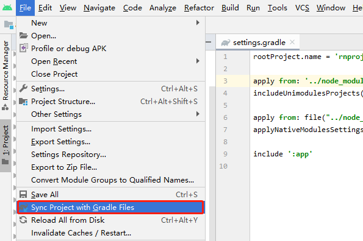
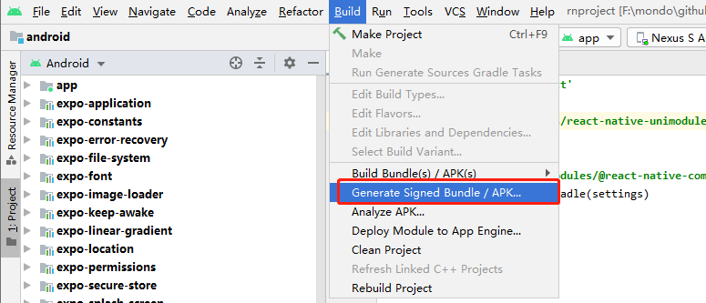
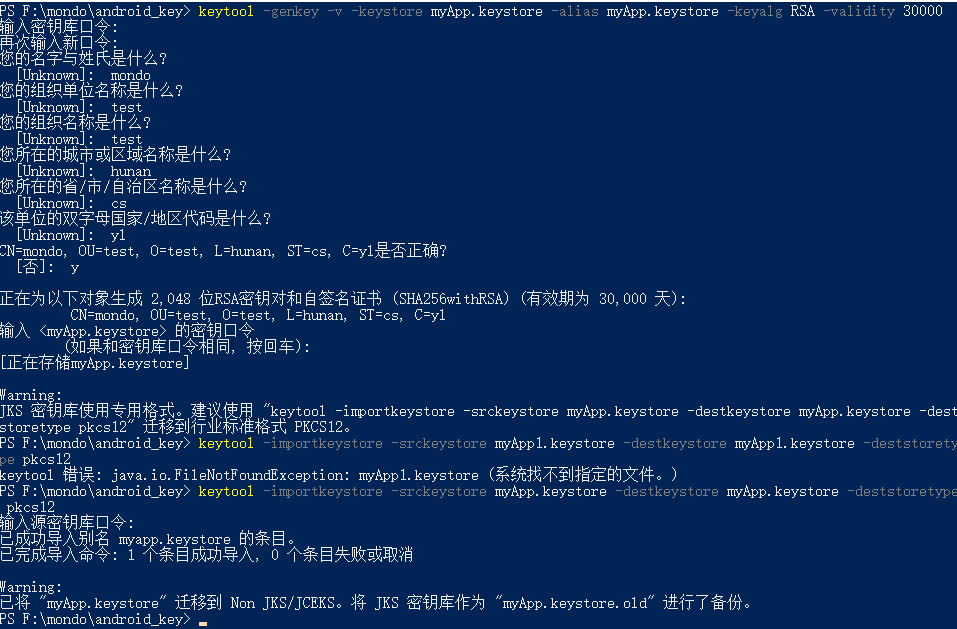
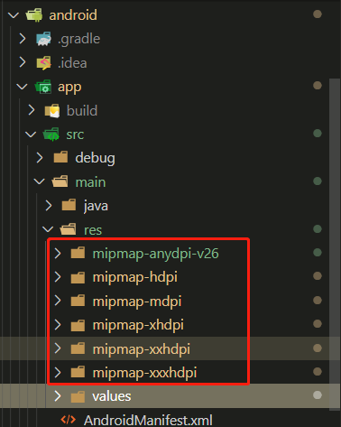
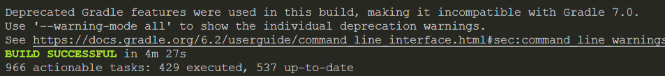
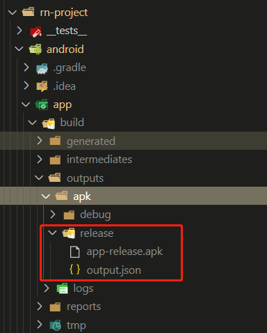

# 打包发布

## 打包 APK

> Android 打包参考[官方网站](https://reactnative.cn/docs/signed-apk-android)流程

### 生成签名证书

#### Android Studio 生成
可以按照[谷歌文档](https://developer.android.com/studio/publish/app-signing?hl=zh-cn#generate-key)对应生成即可。这里要注意的是可能有些 `Android Studio` 没有 `Generate signed apk` 这个选项，这里需要我们点击 File ->选择如图 `Sync Project with Gradle Files` 选项



然后可以在 `Build` 项看到 `Generate signed apk`



#### 命令生成

除了使用 `Android Studio` 自动生成证书，也可以执行命令来生成证书

```shell
keytool -genkey -v -keystore myApp.keystore -alias myApp.keystore -keyalg RSA -validity 30000
```

参数含义

| 参数 | 含义 |
| --- | --- |
| keytool  | 工具名称（固定写法） |
| )-genkey | 执行的是生成数字证书操作（固定写法） |
| -v | 打印生成证书的详细信息 |
| -keystore myApp.keystore | 生成的证书的文件名为"myApp.keystore"(根据需求，设置你的证书名) |
| alias myApp.keystore | 证书的别名为"myApp.keystore"。<br />(一般和上面的文件名相同，可以不同，但要记好，签名时会用**(A)**) |
| -keyalg RSA | 生成密钥文件采用的算法为RSA(固定写法) |
| -validity 3000 | 该数字证书的有效期为30000天，30000天之后该证书将失效 |


按照提示一步步执行即可



最后生成了密钥证书

### 设置gradle变量


- 把生成的证书复制到项目 `/android/app/` 目录下
- 编辑项目中的 `gradle.properties` 文件

```javascript
MYAPP_RELEASE_STORE_FILE=myApp.keystore
MYAPP_RELEASE_KEY_ALIAS=myApp.keystore
MYAPP_RELEASE_STORE_PASSWORD=123456
MYAPP_RELEASE_KEY_PASSWORD=123456
```

### 添加签名配置

修改 `android/app/build.gradle`

```javascript
   signingConfigs {
        ...
        release {
            storeFile file(MYAPP_RELEASE_STORE_FILE)
            storePassword MYAPP_RELEASE_STORE_PASSWORD
            keyAlias MYAPP_RELEASE_KEY_ALIAS
            keyPassword MYAPP_RELEASE_KEY_PASSWORD
        }
    }
    buildTypes {
        debug {
            signingConfig signingConfigs.debug
        }
        release {
            signingConfig signingConfigs.release
          	...
        }
    }
```

### 修改应用名称

修改 `/android/app/src/main/res/values/strings.xml` 文件

```javascript
<resources>
  <string name="app_name">应用名称</string>
</resources>
```
### 修改应用 Icon
将下列目录下的图标替换成需要的 Icon 即可，推荐使用 `Android Studio` 自带的  [image-asset-studio](https://developer.android.com/studio/write/image-asset-studio) 工具



### 签名打包
进入 `/android` 根目录执行命令 `./gradlew assembleRelease`



成功后可以在 `/android/app/build/outputs/apk` 目录下找到打包后的 `apk` 文件



## 异常处理

- 出现  `Error: Cannot create directory ..\mergeDebugResources\merged.dir\values`

执行命令
```shell
cd android
./gradlew clean
cd .. 
yarn android
```
