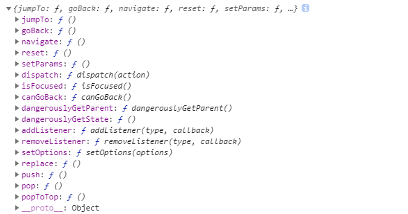

# 导航和路由

不同于 react web 单页应用，React Native 是以多页面形式存在的，以导航的方式在步同的页面和组件间进行切换，使用 [react-navigation](https://reactnavigation.org/docs/getting-started) 导航库展示。

## 依赖安装
```powershell
yarn add @react-navigation/native
yarn add react-native-reanimated react-native-gesture-handler react-native-screens react-native-safe-area-context @react-native-community/masked-view
yarn add @react-navigation/stack
```

## 内置导航模块


- StackNavigator：创建导航屏栈（stack），所有屏（screen）以栈的方式存在，一次渲染一屏，在切换屏时提高变换动画，当打开某一屏时，将该屏放置在栈顶
- TabNavigator：创建一个Tab式导航，渲染一个Tab菜单栏，使用户可以切换不同屏
- DrawerNavigator：创建抽屉式导航，从屏的左边滑出一屏

## 底部导航

我们来完成一个常见的移动 app 布局，底部 Tabs

- 先要安装底部导航依赖

```powershell
yarn add @react-navigation/bottom-tabs
```

- 创建底部导航

新建 Tabs.routes.js 文件

```javascript
import React from 'react';
import {NavigationContainer} from '@react-navigation/native';
import {createBottomTabNavigator} from '@react-navigation/bottom-tabs';

import Home from './pages/Home';
import Mine from './pages/Mine';

const Tab = createBottomTabNavigator(); // 创建底部导航栈

export default () => {
  return (
    <NavigationContainer>
      <Tab.Navigator
        tabBarOptions={{ // tab style
          activeTintColor: '#FE9727',
          inactiveTintColor: '#222222',
          // tabStyle: {},
        }}>
        <Tab.Screen
          name="Home" // 路由名称
          component={Home} // 对应的路由
          options={{
            tabBarLabel: '首页', // tab name
          }}
        />
        <Tab.Screen
          name="Mine"
          component={Mine} // 对应的路由
          options={{
            tabBarLabel: '我的', // tab name
          }}
        />
      </Tab.Navigator>
    </NavigationContainer>
  );
};

```

引入到 App.js 文件中

```javascript
import React from 'react';
import Router from './routes/Tabs.route';

export default function App() {
  return <Router/>;
}
```
效果如下


## 嵌套路由
底部导航嵌套多个子路由页面，主页面 -> 子页面，这里需要使用到 Stack 栈导航
```javascript
import React from 'react';
import {createStackNavigator} from '@react-navigation/stack';

import HomeScreen from '../pages/Home';
import HomeDetailsScreen from '../pages/Home.details';

const SiteStack = createStackNavigator(); // 栈导航

const HomeStackScreen = () => {
  return (
    <SiteStack.Navigator>
      <SiteStack.Screen
        name="Home"
        component={HomeScreen}
      />
      <SiteStack.Screen
        name="Details"
        component={HomeDetailsScreen}
      />
    </SiteStack.Navigator>
  );
};

export default HomeStackScreen;
```
效果如下


## 路由传值
由于路由放入导航后，路由页面默认接收 `navigation` 对象，使用 `navigation.navigate` 方法跳转页面传入参数
```javascript
const Home = ({navigation}) => {
  navigation.navigate('Details', {
    id: 2,
  });
}
```
这只是其中一种传参方式，具体可[参考文档](https://reactnavigation.org/docs/route-prop)

页面接受参数，跳转子页面接收 `route`，`navigation` 两个参数，从 `route` 对象中取出传入的参数
```javascript
const Details = ({route, navigation}) => {
	console.log(route.params.id) // 2
  ...
}
```
`navigation` 对象中存在部分方法



- `setOptions` 动态修改页面 Head 
- `goBack` 返回
- `push` 可以跳转到相同路由 Details -> Details
- `popToTop` 返回堆栈中的第一个页面
